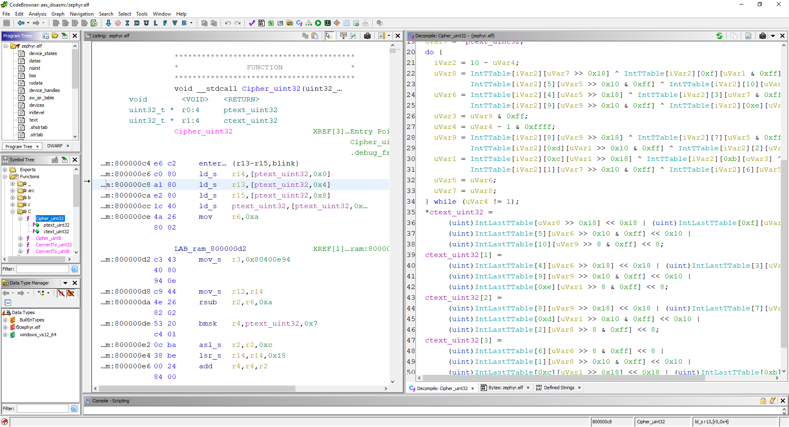

### Description
This extension implements ARCv2 instruction set that can be used for disassembly, decompilation and emulation on Ghidra.

### Installation
Download a pre-built release and unzip it to

`<ghidra_folder>\Ghidra\Processors`

### Example
The example folder contains an AES-128 white-box implementation compiled for ARCv2 instruction set. 
Start a new project in Ghidra and then open a file:

`<ghidra_folder>\Ghidra\Processors\ARCv2\example\AES\AES.elf`

Execute a standard analysis of the binary.

Go to the function `Cipher_uint32` - the binary shall be disassembled and the function shall be correctly decompiled.

### TODO
* EXT5 instruction support
* Switching the set of used registers

### License
This extension is licensed under the Apache License Version 2.0.
